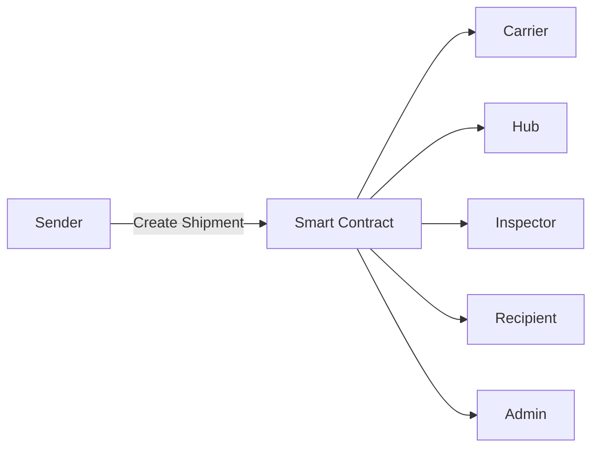
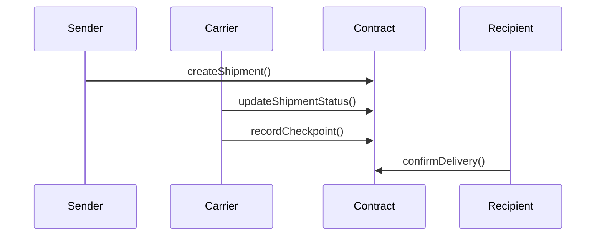

# 📦 LogisticsTracking — On-Chain Logistics Traceability System


Sistema descentralizado de trazabilidad logística basado en smart contracts que garantiza transparencia, inmutabilidad y auditabilidad en toda la cadena de suministro.

---

## 📌 Descripción

LogisticsTracking permite registrar y seguir envíos en blockchain:

- 📦 Creación de envíos
- 🚚 Seguimiento en tiempo real (on-chain)
- 🌡️ Validación de cadena de frío
- ⚠️ Gestión de incidencias
- ✅ Confirmación de entrega

---

## 🏗️ Arquitectura



---

## 🔄 Flujo



---

## ⚙️ Instalación

```bash
git clone https://github.com/tuusuario/logistics-tracking.git
cd logistics-tracking
forge install
forge build
```

---

## 🧪 Testing

```bash
forge test -vv
```

---

## 🔁 CI/CD

Incluye GitHub Actions para build, test y coverage.

---

## 📄 Licencia

MIT
